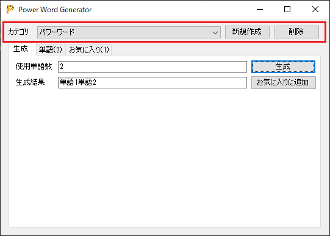

# PowerPordGenerator
事前に登録した単語をランダムに組み合わせて新たなパワーワードを生成することができるWindowsフォームアプリです。

## 動作環境
実行環境に以下のソフトウェアがインストールされている必要があります。  
・.NET Framework 4.7.2以降

## 利用手順
1.Rereaseより「PowerWordGenerator.zip」をダウンロードする。  
2.zipファイルを解凍し、中身の「PowerWordGenerator」フォルダを任意の場所に配置する。  
3.「PowerWordGenerator.exe」を実行する。

## 操作方法
### カテゴリ欄
登録した単語、お気に入りの単語は全てカテゴリに紐づけられます。

[新規作成]・・・カテゴリを新規作成します。

[削除]・・・カテゴリを削除します。カテゴリに紐づいた単語・お気に入りのデータも削除されます。

### 生成タブ
[使用単語数]・・・単語をいくつ組み合わせるか指定できます。

[生成]・・・パワーワードを生成します。

[生成結果]・・・生成したパワーワードを表示します。

[お気に入りに追加]・・・生成結果をお気に入りに追加します。

### 単語タブ
[追加]・・・入力した単語を登録します。

[削除]・・・選択した単語を削除します。

### お気に入りタブ
[コピー]・・・選択した単語をクリップボードにコピーします。

[削除]・・・選択した単語を削除します。

